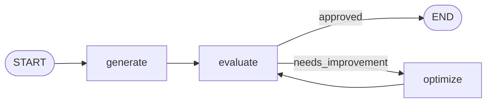

# 🐦 Tweet-forge


A LangGraph loop that writes a tweet, evaluates it like a ruthless editor, and rewrites it until it earns approval — or runs out of tries.

## What it does

The whole thing is a loop between three LLM personas. A generator drafts a tweet from whatever topic you give it, writing like a top-tier X creator: witty, concise, one strong idea, no clichés, no AI-sounding filler.

That draft goes to an evaluator, which acts like a ruthless editor. It assumes every tweet starts at zero and has to earn its approval, checking things like originality, hook strength, clarity, and whether the ending actually lands. It auto-rejects anything too long, generic, AI-sounding, or leaning on hashtags and clickbait.

If it's not approved, the feedback goes to an optimizer, which rewrites the tweet accordingly, and the new draft goes straight back to the evaluator. This keeps cycling until the tweet is approved or `max_iteration` is hit, whichever comes first.

## The graph



Just a conditional edge deciding whether to exit or keep looping.

## State

<details>
<summary>tap to expand the state shape</summary>

```python
class TweetState(TypedDict):
    topic: str
    tweet: str
    evaluation: Literal["approved", "needs_improvement"]
    feedback: str
    iteration: int
    max_iteration: int
    tweet_history: Annotated[list[str], operator.add]
    feedback_history: Annotated[list[str], operator.add]
```

`tweet_history` and `feedback_history` use LangGraph's `operator.add` reducer, so every draft and every round of feedback accumulates across iterations instead of getting overwritten. Handy for tracing how a tweet evolved rather than just seeing the final result.

</details>

## Models

All three roles currently run on `openai/gpt-oss-120b` through Groq. Nothing stops you from putting a different model on each node though, say a cheaper one for generation and a sharper one for evaluation, since that's the node doing the actual gatekeeping.

## Setup

```bash
pip install langgraph langchain-groq python-dotenv pydantic
```

Drop your Groq key into a `.env` file:

```
GROQ_API_KEY=your_key_here
```

## Usage

```bash
python tweet_forge.py
```

It'll ask for a topic, then iterate (5 rounds max by default) until it lands on something worth posting, printing the final tweet along with the evaluator's verdict and feedback.

<details>
<summary>example run</summary>

```
Enter topic: cold coffee

Final Tweet:
...

Evaluation: approved

Feedback:
...
```

</details>

## Rough edges

<details>
<summary>no retry / error handling</summary>

There's no retry or error handling around the Groq calls, so a rate limit or dropped connection just crashes the run.

</details>

<details>
<summary>structured output dependency</summary>

The evaluator depends on structured output support, so swapping in a different model means checking it still works with `.with_structured_output()`.

</details>

<details>
<summary>character limit isn't code-enforced</summary>

The 280-character limit is only enforced through the prompt — nothing in code actually stops a model from ignoring it.

</details>
